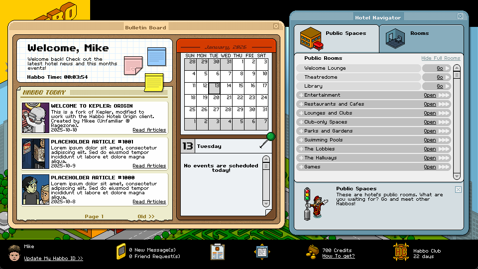
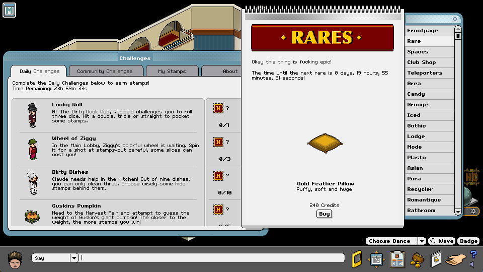
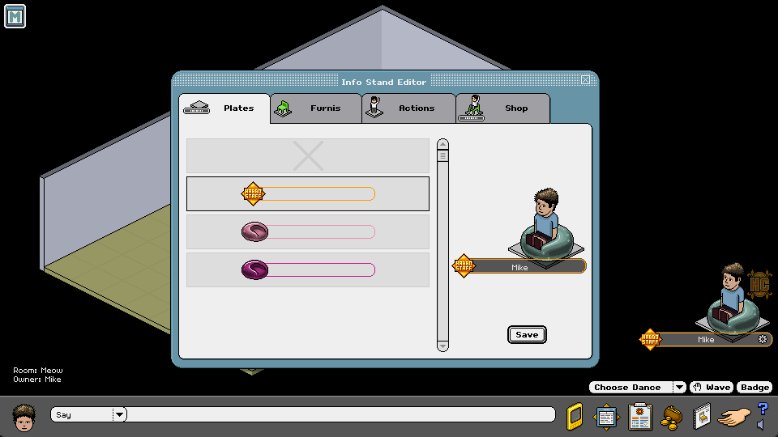
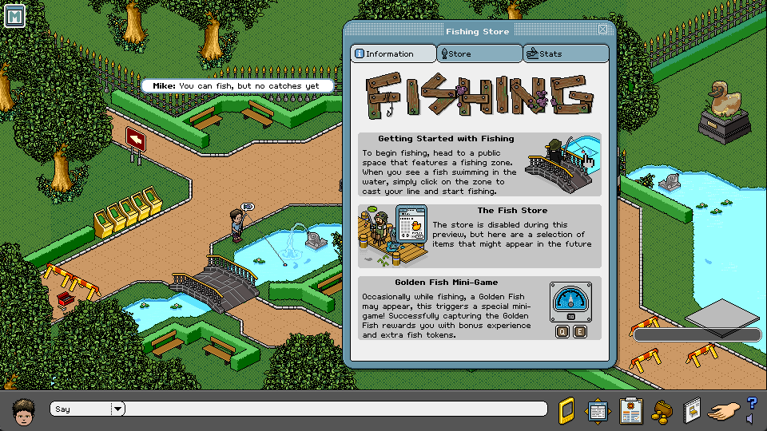

# Kepler: Origins

Kepler: Origins is a Habbo Hotel emulator that is designed to fully emulate Habbo Hotel: Origins server from 2026. 
The server is written in Java and using various libraries, such as Netty, an asynchronous networking library, Log4j and the Apache commons libraries.

> This is a fork of the original Kepler project, which can be found here [https://github.com/Quackster/Kepler](https://github.com/Quackster/Kepler).  
> Kepler is quite possibly the most complete v14 Habbo Hotel released to date, and has been in development since January 2018.

# Screenshots

(Hotel view)



(Challenges / Automatic rare cycler)



(User info stand)



(Fishing – No catching yet)



# Download

Download the latest development build from the [releases page](https://github.com/UnfamiliarLegacy/KeplerOrigins/releases).

### Requirements

To be honest, this server doesn't require much. I'd argue that the MariaDB server is more resource demanding than the emulator itself. 

- JDK >= 17
- MariaDB server

# Installation

Install MariaDB server, connect to the database server and import Kepler.sql (located in /tools/Kepler.sql).

Download the latest development build from the [releases page](https://github.com/UnfamiliarLegacy/KeplerOrigins/releases) and rename the files to remove the short build hash version, for convenience. 

Install any JDK version that is equal or above >= 17 to run the jar files.

Open run.sh (Linux) or run.bat (Windows) to start Kepler.

❗ Once registered as an admin, make yourself admin by setting your ``rank`` to 7 in the ``users`` table.

# Docker installation

Install [Docker](https://docs.docker.com/engine/install/) and [git](https://git-scm.com/downloads) (optional) on your device.

### 1. Clone repository

```shell
git clone https://github.com/UnfamiliarLegacy/KeplerOrigins.git
```

_You can also [download](https://github.com/UnfamiliarLegacy/KeplerOrigins/archive/refs/heads/master.zip) this repository and unzip it._

### 2. Configure variables

Copy `.env.example` file to `.env` :

```shell
cp .env.example .env
```

You can now configure all variables in `.env` file with values needed.

_Don't change `MYSQL_HOST` except if you change the name of the service `mariadb` in Docker compose file._

_You neither should change `MYSQL_PORT`._

### 3. Start Kepler

You just need to run Docker compose inside of Kepler directory :

```shell
docker compose up -d
```

To stop Kepler :

```shell
docker compose down
```

### Docker FAQ

#### Reset MariaDB database

You need to first stop Kepler, then remove MariaDB volume :

```shell
docker compose down && docker volume rm kepler-mariadb
```

You can now start Kepler again, database will be wiped out !

## License

This program is free software: you can redistribute it and/or modify it under the terms of the GNU General Public License as published by the Free Software Foundation, either version 3 of the License, or (at your option) any later version.


## Cloning this repository

```
$ git clone --recursive https://github.com/UnfamiliarLegacy/KeplerOrigins
```

**or**

```
$ git clone https://github.com/UnfamiliarLegacy/KeplerOrigins
$ git submodule update --init --recursive
```

# Thanks to

* Quackster
* Hoshiko
* ThuGie
* Ascii
* Lightbulb
* Raptosaur
* Romuald
* Glaceon
* Nillus
* Holo Team
* wackfx
* Meth0d
* office.boy
* Leon Hartley
* Alito
* wackfx
